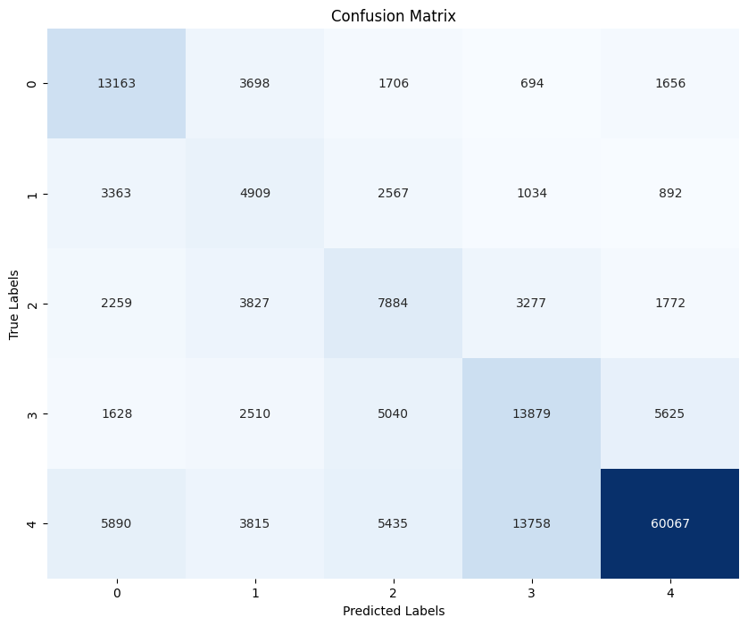
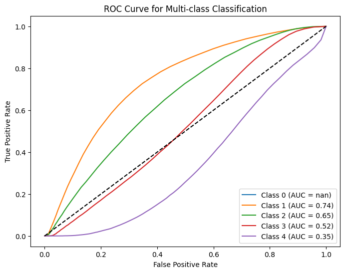
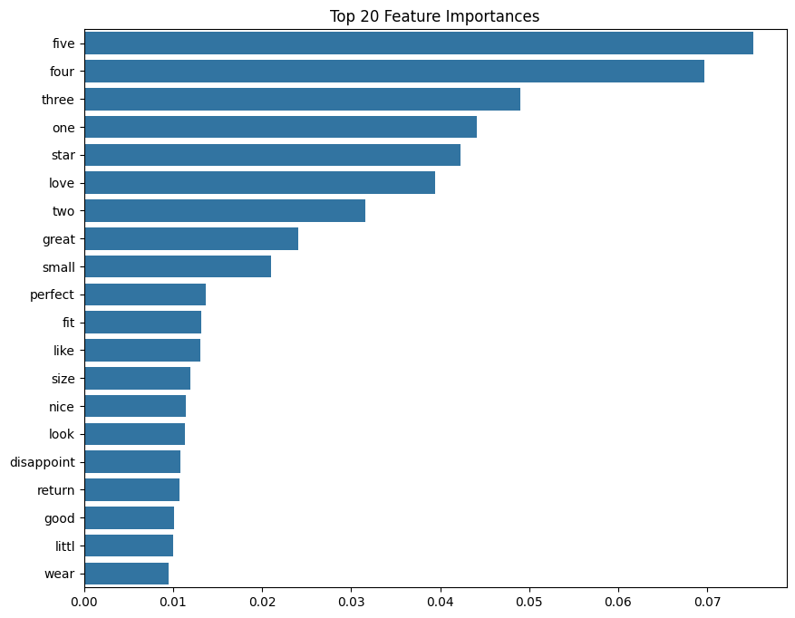
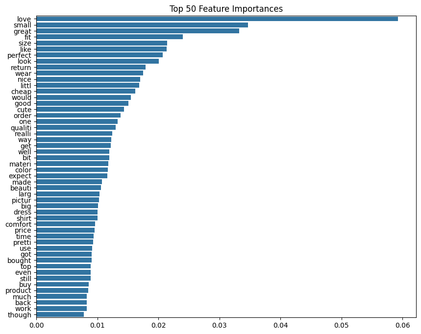
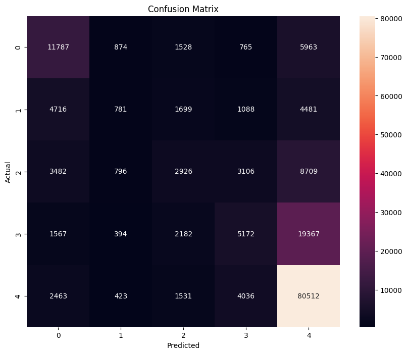
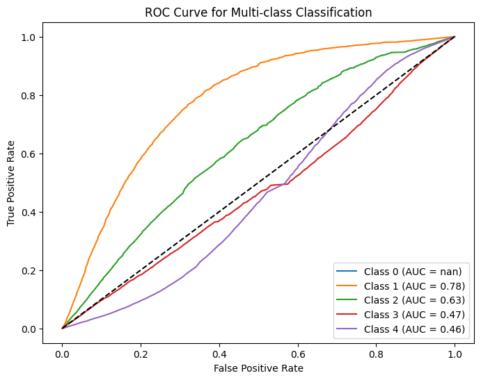

# Random Forest

## Doc2Vec

### Random Forest - (w/ summary tokens)

              precision    recall  f1-score   support

         1.0       0.59      0.57      0.58     20917
         2.0       0.56      0.14      0.23     12765
         3.0       0.50      0.30      0.37     19019
         4.0       0.61      0.33      0.43     28682
         5.0       0.70      0.95      0.81     88965
    accuracy                           0.67    170348
    macro avg      0.60      0.46      0.48    170348
    weighted avg   0.64      0.67      0.62    170348

### Random Forest - (w/ summary tokens + undersampling)

              precision    recall  f1-score   support

         1.0       0.50      0.63      0.56     20917
         2.0       0.26      0.38      0.31     12765
         3.0       0.35      0.41      0.38     19019
         4.0       0.43      0.48      0.45     28682
         5.0       0.86      0.68      0.76     88965
    accuracy                           0.59    170348
    macro avg      0.48      0.52      0.49    170348
    weighted avg   0.64      0.59      0.60    170348

    Class Distribution After Undersampling:
            overall
            1.0    50344
            2.0    50344
            3.0    50344
            4.0    50344
            5.0    50344
            Name: count, dtype: int64

### Random Forest - (w/ custom stopwords + reviewText)

              precision    recall  f1-score   support

         1.0       0.50      0.51      0.50     20917
         2.0       0.25      0.02      0.03     12765
         3.0       0.30      0.07      0.11     19019
         4.0       0.31      0.06      0.10     28682
         5.0       0.61      0.95      0.75     88965
    accuracy                           0.58    170348
    macro avg      0.39      0.32      0.30    170348
    weighted avg   0.49      0.58      0.48    170348

## TFIDF

### Random Forest - (w/ summary and reviewText)

              precision    recall  f1-score   support

         1.0       0.67      0.77      0.71     20917
         2.0       0.72      0.35      0.47     12765
         3.0       0.63      0.44      0.52     19019
         4.0       0.66      0.48      0.55     28682
         5.0       0.79      0.94      0.86     88965
    accuracy                           0.74    170348
    macro avg      0.69      0.60      0.62    170348
    weighted avg   0.73      0.74      0.72    170348

### Random Forest - (w/ reviewText)

              precision    recall  f1-score   support

         1.0       0.49      0.56      0.52     20917
         2.0       0.24      0.06      0.10     12765
         3.0       0.30      0.15      0.20     19019
         4.0       0.37      0.18      0.24     28682
         5.0       0.68      0.90      0.77     88965
    accuracy                           0.59    170348
    macro avg      0.41      0.37      0.37    170348
    weighted avg   0.53      0.59      0.54    170348

MSE scores: 

    {1: 5.224410766362289,
    2: 4.002820211515863,
    3: 2.769125611230874,
    4: 1.297956906770797,
    5: 0.5999550384982858}

### Random Forest - (w/ undersampling majority class)

              precision    recall  f1-score   support

         1.0       0.38      0.59      0.47     20917
         2.0       0.19      0.28      0.22     12765
         3.0       0.24      0.26      0.25     19019
         4.0       0.29      0.38      0.33     28682
         5.0       0.82      0.57      0.67     88965
    accuracy                           0.48    170348
    macro avg      0.38      0.41      0.39    170348
    weighted avg   0.57      0.48      0.51    170348

MSE scores:

    {1: 1.813596596070182,
    2: 1.572424598511555,
    3: 1.6590777643409222,
    4: 1.6318597029495852,
    5: 2.4691845107626595}