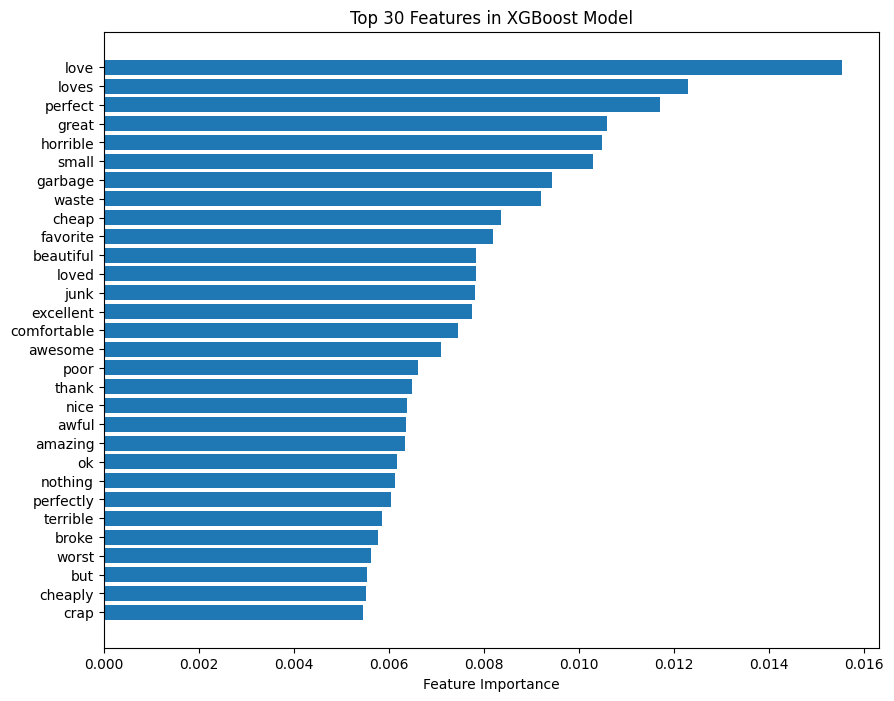
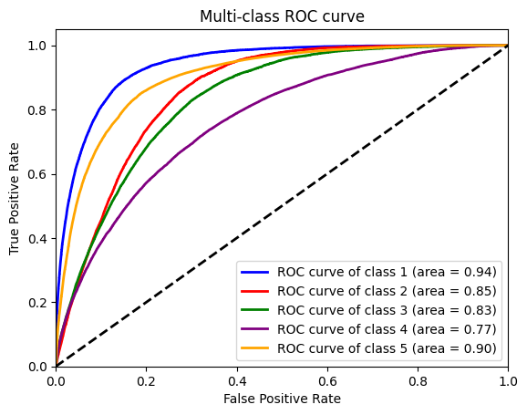

# XGBoost 

              precision    recall  f1-score   support

         0.0       0.59      0.70      0.64     20917
         1.0       0.33      0.07      0.11     12765
         2.0       0.39      0.29      0.33     19019
         3.0       0.47      0.27      0.34     28682
         4.0       0.74      0.93      0.82     88965

    accuracy                           0.66    170348
    macro avg      0.50      0.45      0.45    170348
    weighted avg   0.61      0.66      0.61    170348

